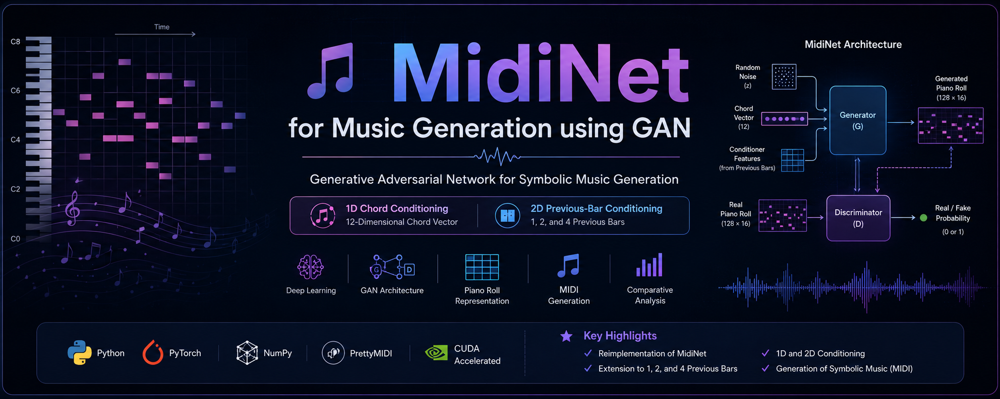
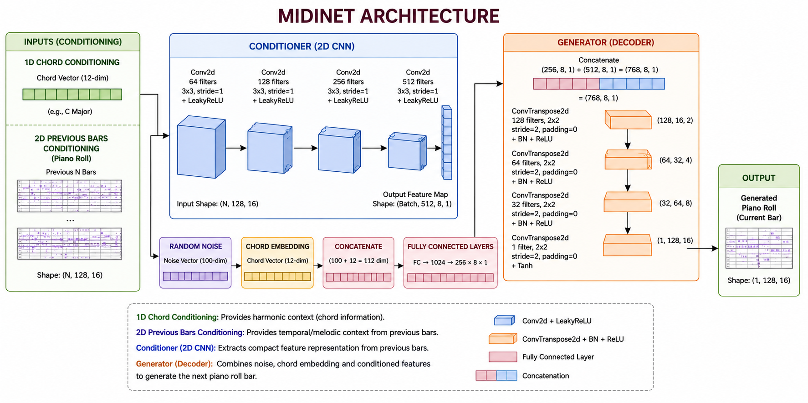
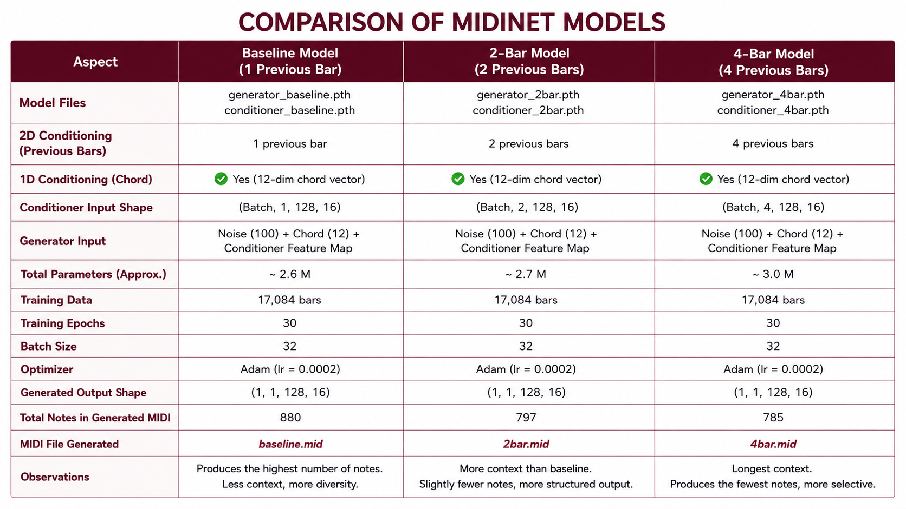

[🇬🇧 English](README.md) | 🇩🇪 Deutsch

# 🎵 MidiNet-Extended: Bedingte symbolische Musikgenerierung mit Generative Adversarial Networks

<p align="center">
  
</p>

## 📖 Projektübersicht

Dieses Projekt präsentiert eine erweiterte Implementierung von **MidiNet**, einem Conditional Generative Adversarial Network (cGAN) zur symbolischen Musikgenerierung.

Im Gegensatz zur ursprünglichen MidiNet-Architektur untersucht diese Arbeit den Einfluss unterschiedlich langer musikalischer Historien auf die Melodiegenerierung. Es wurden drei verschiedene Varianten implementiert und miteinander verglichen:

- 🎼 Basismodell (1 vorheriger Takt)
- 🎼 2-Takt-Historie
- 🎼 4-Takt-Historie

Das Projekt wurde im Rahmen eines Master-Forschungsmoduls entwickelt, um den Einfluss sequentieller Konditionierung auf die automatische Musikgenerierung zu analysieren.

---

# 🚀 Funktionen

- Conditional GAN (MidiNet)
- Implementierung mit PyTorch
- Akkordbasierte Melodiegenerierung
- Mehrere Historienlängen
- Automatische MIDI-Erzeugung
- Datenvorverarbeitung
- Trainings- und Evaluierungsskripte

---

# 🧠 Modellvarianten

| Modell | Musikalischer Kontext |
|---------|-----------------------|
| Basismodell | 1 vorheriger Takt |
| Erweiterung 1 | 2 vorherige Takte |
| Erweiterung 2 | 4 vorherige Takte |

---

# 📊 Ergebnisse

| Modell | Generierte Noten |
|---------|------------------:|
| Basismodell | 880 |
| 2-Takt-Historie | 797 |
| 4-Takt-Historie | 785 |

Die Experimente zeigen, dass eine längere musikalische Historie die Struktur der generierten Melodien beeinflusst und gleichzeitig die Harmoniekonsistenz beibehält.

---

# 🏗️ Architektur

<p align="center">

</p>

---

# 📈 Modellvergleich

<p align="center">

</p>

---

# 📁 Projektstruktur

```text
MidiNet-Extended/
│
├── assets/
│   ├── banner.png
│   ├── architecture.png
│   └── comparison.png
│
├── data/
│   ├── raw/
│   ├── processed/
│   └── README.md
│
├── models/
│   ├── generator.py
│   ├── discriminator.py
│   └── conditioner.py
│
├── outputs/
│   ├── baseline.mid
│   ├── 2bar.mid
│   └── 4bar.mid
│
├── saved_models/
│   ├── generator_baseline.pth
│   ├── generator_2bar.pth
│   ├── generator_4bar.pth
│   ├── conditioner_baseline.pth
│   ├── conditioner_2bar.pth
│   └── conditioner_4bar.pth
│
├── preprocess.py
├── dataset.py
├── train.py
├── generate.py
├── evaluate.py
├── pt_to_midi.py
├── config.py
├── requirements.txt
├── .gitignore
└── README_DE.md
```

---

# ⚙️ Installation

Repository klonen

```bash
git clone https://github.com/IHR_BENUTZERNAME/MidiNet-Extended.git
cd MidiNet-Extended
```

Virtuelle Umgebung erstellen

```bash
python -m venv .venv
```

Virtuelle Umgebung aktivieren (Windows)

```bash
.venv\Scripts\activate
```

Abhängigkeiten installieren

```bash
pip install -r requirements.txt
```

---

# 📂 Datensatz

Der ursprüngliche Datensatz ist aufgrund von Lizenzbestimmungen und der Dateigröße **nicht** im Repository enthalten.

Zur Reproduktion der Experimente:

1. Die MIDI-Dateien in

```
data/raw/
```

ablegen.

2. Anschließend die Vorverarbeitung starten:

```bash
python preprocess.py
```

---

# 🏋️ Training

Das Modell trainieren:

```bash
python train.py
```

Für die Experimente wurde der Parameter

```python
HISTORY = 1
HISTORY = 2
HISTORY = 4
```

in der Datei

```
config.py
```

angepasst.

---

# 🎹 Musik generieren

Piano-Roll erzeugen

```bash
python generate.py
```

In MIDI umwandeln

```bash
python pt_to_midi.py
```

Die generierten Dateien werden im Ordner

```
outputs/
```

gespeichert.

---

# 🛠 Verwendete Technologien

- Python
- PyTorch
- NumPy
- pretty_midi
- MIDI Toolkit
- Generative Adversarial Networks (GAN)
- Conditional GAN
- Deep Learning

---

## 🚀 Zukünftige Arbeiten

- Training des Modells mit größeren symbolischen Musikdatensätzen
- Untersuchung transformerbasierter Modelle zur Musikgenerierung
- Verbesserung der langfristigen musikalischen Kohärenz
- Integration objektiver Bewertungsmetriken (z. B. Tonhöhenvielfalt und tonale Konsistenz)
- Entwicklung einer Webanwendung zur Echtzeit-Musikgenerierung

---

# 📚 Referenz

Originalveröffentlichung:

Yang, L.-C., Chou, S.-Y., & Yang, Y.-H.

**MidiNet: A Convolutional Generative Adversarial Network for Symbolic-domain Music Generation**

ISMIR 2017.

---

# 👨‍💻 Autor

**Arbaz Khan**

M.Sc. Artificial Intelligence

BTU Cottbus, Deutschland

Interessengebiete:

- Machine Learning
- Deep Learning
- Generative KI
- Natural Language Processing (NLP)
- Music AI
- Computer Vision

---

## ⭐ Wenn Ihnen dieses Projekt gefällt, freue ich mich über einen Stern auf GitHub!